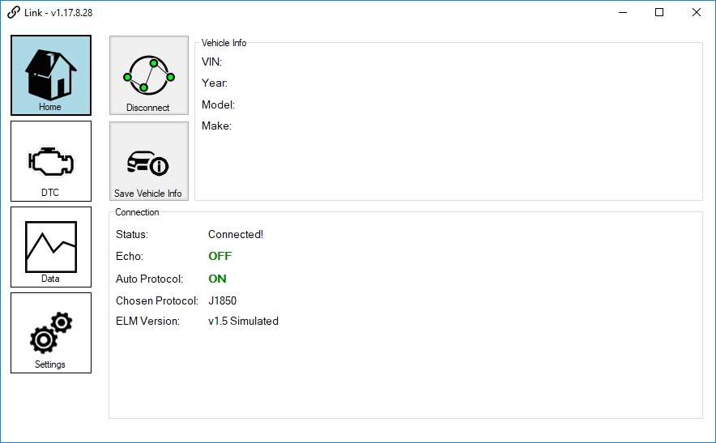
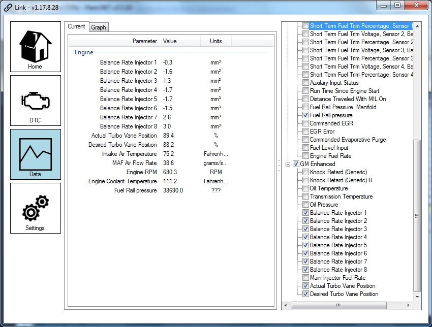

# About Link
An application for reading, logging, and visualizing OBD data using ELM327 based protocols, cables, and adapters.

# Prerequisites
Link requires .Net 4.5 or later if you are running the binary. Almost all copies of Windows 8.1 and 10 come with this pre-installed.

If developing, you will need Visual Studio 2013 Express or Visual Studio 2017 Community in addition to .Net 4.5.

# Using Link

## Getting Started
To get started using Link, after you satisfied the prerequisites above, you can run the stand alone executable, or download the installer from the releases page. From the Home panel (as selectable from the left buttons), there will be a connect button. Simply click Connect, and if your adapter is correctly identified it will show as connected with all green dots filled on the Connect button. An error message will be displayed if connection could not be established.

## Viewing Data
Once connected, go to the Data panel and a new UI will show. On the right there are check boxes with collapse-able trees. These are the available PIDs that Link knows about and can try to work with. At the present time, it does no checking to see if your vehicle is supported for any given PID. The application assumes the user knows which ones are supported by their vehicle. You can check and uncheck these PIDs as you please after connecting.

